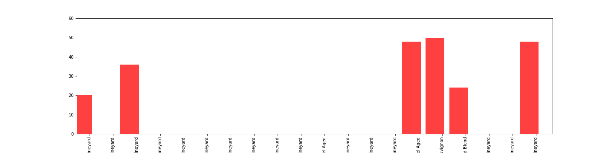

# Project-2-ETL
### Objective :

This project is required to achieve ETL - extract, transform and load databases.  At least two datasets are required, and one database is needed.

### Authors :

Henry Nahmad, Hillary Rosado Mendez and Emily Mo

### Process :

First, we webscraped the Cellar Tracker website by wine_inventory.ipynb. Only California red wines were selected.  It harvested 367 different wines and output the result to a table called wine_collection in MySQL's wine_db.

Then wine_inventory.ipynb reads wine_collection and separate the wine column such that the first 4 characters became vintage and the rest became the wine column.  With the new wine column, another webscraping was performed. This time to pass the wine to the website Wine Searcher and find out its score.  

Out of 367 wines, there were only 23 with scores.  These 23 wines were then written to MySQL as table top_20_wines.  

Restocking_wine.ipynb is called when the restaurant has a delivery of wine. This python program accepts the wine, vintage and the number of bottles delivered to the restaurant.  And the number of bottles is updated in the table top_20_wines.

Top_reviews_graph.ipynb is to read the table top_20_wines, sorts the wines in descending order of score (with the most popular wine listed first) and plots a bar chart of these wines with their inventory.  

App.py lists the top_20_wines on the left and shows the bar chart on the right. This is to help the restaurant to determine when to 
re-stock their popular wines. 

The project holds :
- app.py
- top_reviews_graph.ipynb
- wine_inventory.ipynb
- wine_ranking.ipynb
- folder templates which houses index.html
- folder static which houses TopWineInStock.png output by top_reviews_graph.ipynb and used by index.html

